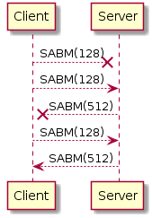
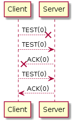
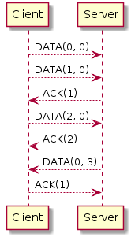
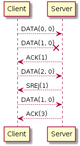
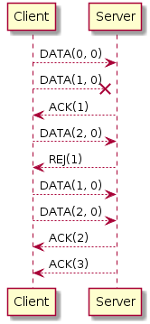

# SWTP
## Introduction
SWTP is a HDLC-based network tunneling protocol. It can be used for creating a pipe between two communicating entities.

## Goals
The main goal of SWTP is to forward frames from one end to another, making sure that no frames are lost. It does not detect network congestion, and does not try reducing the frame rate in order to reduce losses.

## Assumptions
SWTP assumes that:
  - It's working over another protocol that already checks whether the contents of the frame are correct or not.
  - The frame size can be determined from lower protocols.
  - Some frames can be lost.
  - The link between the two ends can suffer from delay.

## Implications
  - SWTP does not implement any checksum field, as it assumes that frame integrity should already be guaranteed by another (lower) protocol such as IP.
  - SWTP must include a frame loss detection and lost frame retransmission mechanism.
  - SWTP must be able to support large enough window sizes, so that a high delay between the operator network and the customer's router does not reduce the link speed because of window saturation.

## Frame format
Bytes are sent in network order (big-endian)

Every SWTP frame has a 32-bit command field that determines the role of the frame:
```
Bit  | 10987654321098765432109876543210
-----+---------------------------------
Data | 0sssssssssssssss?rrrrrrrrrrrrrrr
-----+---------------------------------
Ctrl | 1xxxxxxxxxxxxxxxxxxxxxxxxxxxxxxx
```

### Data frames
A data frame basically has 4 main fields:
  - Sent frame number (s): the number of the current sent frame
  - Received frame number (r): the number of the last received frame in sequence + 1 (which means that if you've received frames 0 and 2, this number will be 1)
  - Payload: user-defined (directly after the command field)

Frame sequence numbers are 15-bit wide, allowing frame numerotation from 0 to 32767. This is a relatively large value that can prevent 

### Control frames
A control frame has different formats:
```
Bit  | 10987654321098765432109876543210
-----+---------------------------------
SABM | 1000?????????????wwwwwwwwwwwwwww
-----+---------------------------------
DISC | 1001????????????????????????????
-----+---------------------------------
TEST | 1010?????????????rrrrrrrrrrrrrrr
-----+---------------------------------
SREJ | 1100?????????????rrrrrrrrrrrrrrr
-----+---------------------------------
REJ  | 1101?????????????rrrrrrrrrrrrrrr
-----+---------------------------------
ACK  | 1110?????????????rrrrrrrrrrrrrrr
```

#### Set Asynchronous Balanced Mode (SABM)
This command initiates the connection. It contains the Window Size field that indicates the maximum window size allowed on the sender side.

#### Disconnect (DISC)
This command indicates that the connection is finished.

#### Test (TEST)
This command is used for periodically checking whether the other end is still connected after a certain delay. It contains the sequence number of the last received frame in order (i.e. if frames 0 and 2 have been received but frame 1 is missing, this field will be equal to 1).

#### Selective reject (SREJ)
This command asks the other end to retransmit a frame with the given number.

#### Reject (REJ)
This command asks the other end to retransmit the data in its window from the frame that has the given sequence number.

#### Acknowledge (ACK)
This command indicates that a frame has been received correctly. It contains the sequence number of the last received frame in order (i.e. if frames 0 and 2 have been received but frame 1 is missing, this field will be equal to 1).

## Protocol application examples
### Connect
To make a SWTP tunnel connection, the client first sends a SABM frame to the server, which will answer with another SABM frame..

If the client does not receive the SABM response frame after a certain amount of time, then it should consider retrying.

The following chronogram shows what happens, even if something goes wrong:



### Disconnect
To break a SWTP connection, the end that wants to disconnect just sends a DISC frame and stops answering to the other end's frames.

This way, if the DISC frame is received correctly, the other end will (silently) close the connection on its side. If the DISC frame was lost, then the TEST will time-out and the other end will end up closing the connection by itself.

### Periodic test
If no frames were exchanged for an extended period of time, both ends will try to poll the other in order to check if it is still connected. This is done by sending a TEST frame, to which an ACK reply is expected. As some frames can be lost, both ends should ping the other at least 3 times before declaring a connection loss.

The following chronogram shows how it is done:



### Sending data
DATA frames are used for sending data. The other end must reply with an ACK frame for every data frame received, or if it has a frame to send, it can acknowledge the data frame using the "r" field of the frame. In this example, the data frame from server to client describes this behavior:



### Frame loss
When a data frame is lost, the receiving end decides which frame reject mechanism will be used.

In this example, selective reject is used:



In this example, simple reject is used:



If the last frame of a frame train was lost, the frame loss is detected by the sending end, when it detects that the last frame was not acknowledged after a certain delay. It should then try to retransmit it, and reset the timer.
